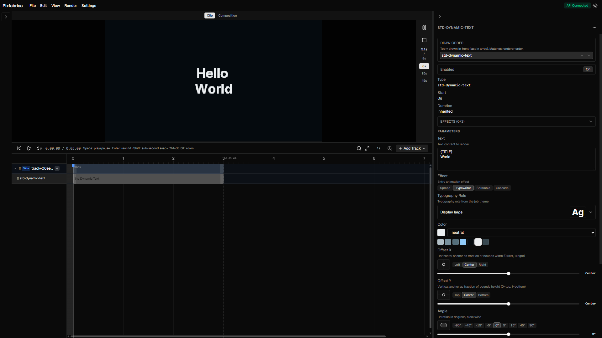

# Pixfabrica

A browser-based motion graphics editor for short-form video.
Stack pre-built animated clips on a timeline, tune them lightly, and render to MP4.

Licensed under [MIT](LICENSE).



## What you get

- Timeline editor with platform presets (YouTube Shorts, TikTok, Reels, and more)
- Plugin clip library - backgrounds, dynamic text, audio-reactive visuals, effects
- Live preview and MP4 export via FFmpeg
- Optional compose agent when Ollama is available (local / Docker profile)

## Develop locally

**Windows**

```bat
doctor.bat
setup.bat
run-all.bat
```

**macOS / Linux**

```bash
chmod +x doctor.sh setup.sh run-all.sh
./doctor.sh
./setup.sh
./run-all.sh
```

Opens the editor at **http://localhost:5173** (API on **8000**).

| Tool | Required |
|------|----------|
| [Python 3.12](https://www.python.org/) + [uv](https://docs.astral.sh/uv/) | yes |
| [pnpm](https://pnpm.io/) | yes |
| [FFmpeg](https://ffmpeg.org/) | recommended (required for export) |
| [Ollama](https://ollama.com/) | optional (compose agent) |

See [CONTRIBUTING.md](CONTRIBUTING.md) for tests, lint, and PR expectations.

## Docker

Local demo at **http://localhost:8080** (CPU / Skia-friendly; `gl.available: false` without a GPU overlay).

```bash
cp docker/.env.example docker/.env
docker compose --env-file docker/.env -f docker/compose.yml up --build
```

**GPU in Docker:** Linux + NVIDIA Container Toolkit - add `-f docker/compose.gpu.yml` and confirm `/api/health` → `gl.available: true`. On Windows/macOS Docker Desktop, use **`run-all`** for OpenGL; compose stays CPU-only. Details: **[docker/README.md](docker/README.md)**.

## Documentation

| Topic | Link |
|-------|------|
| Architecture and design | [docs/ARCHITECTURE.md](docs/ARCHITECTURE.md) |
| API | [api/README.md](api/README.md) |
| Web UI | [web/README.md](web/README.md) |
| Plugins | [plugins/README.md](plugins/README.md) |
| CLI | [cli/README.md](cli/README.md) |
| Roadmap | [docs/ROADMAP.md](docs/ROADMAP.md) |

## Repo layout

| Package | Role |
|---------|------|
| `core/` | Shared models - graph, audio bus, theme, plugin protocol |
| `api/` | FastAPI - jobs, preview, gallery, render queue |
| `renderer/` | Skia CPU + GPU render engine |
| `plugins/std/` | Built-in clip library |
| `web/` | React timeline editor |
